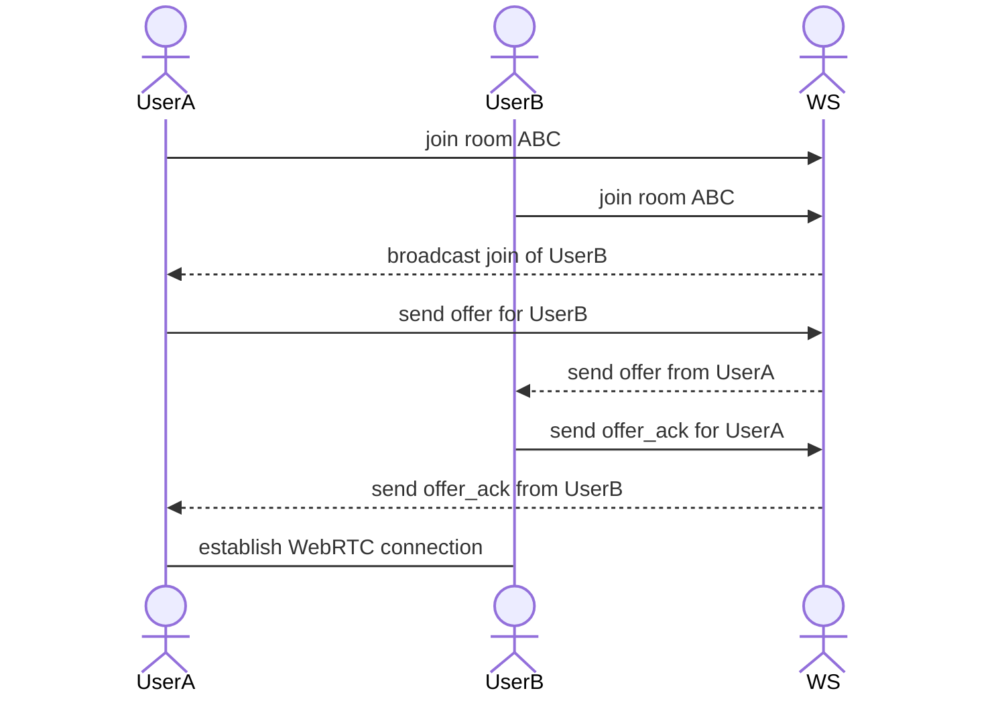

# RTC connection flow

```mermaid
sequenceDiagram
    actor UserA
    actor UserB
    actor WS

    UserA ->> WS: join room ABC
    UserB ->> WS: join room ABC
    WS -->> UserA: broadcast join of UserB
    UserA ->> WS: send offer for UserB
    WS -->> UserB: send offer from UserA
    UserB ->> WS: send offer_ack for UserA
    WS -->> UserA: send offer_ack from UserB
    UserA -> UserB: establish WebRTC connection
```
