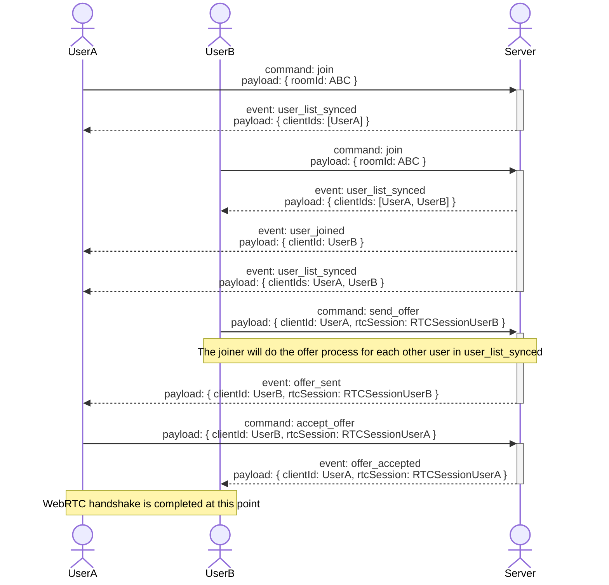

# RTC connection flow

```mermaid
sequenceDiagram
    actor UserA
    actor UserB
    actor WS as Server

    UserA ->>+ WS: command: join<br>payload: { roomId: ABC }
    WS -->>- UserA: event: user_list_synced<br>payload: { clientIds: [UserA] }
    UserB ->>+ WS: command: join<br>payload: { roomId: ABC }
    WS -->> UserB: event: user_list_synced<br>payload: { clientIds: [UserA, UserB] }
    WS -->> UserA: event: user_joined<br>payload: { clientId: UserB }
    WS -->>- UserA: event: user_list_synced<br>payload: { clientIds: UserA, UserB }
    UserB ->>+ WS: command: send_offer<br>payload: { clientId: UserA, rtcSession: RTCSessionUserB }
        Note over UserB, WS: The joiner will do the offer process for each other user in user_list_synced
    WS -->>- UserA: event: offer_sent<br>payload: { clientId: UserB, rtcSession: RTCSessionUserB }
    UserA ->>+ WS: command: accept_offer<br>payload: { clientId: UserB, rtcSession: RTCSessionUserA }
    WS -->>- UserB: event: offer_accepted<br>payload: { clientId: UserA, rtcSession: RTCSessionUserA }
    Note over UserA, UserB: WebRTC handshake is completed at this point
```
